# EisenFlow: Tu Gestor de Tareas con Priorización Instantánea

## Descripción del Proyecto

**EisenFlow** es una aplicación web dinámica y completa diseñada para transformar tu forma de organizar y priorizar tareas. Basada en los sólidos principios de la **Matriz de Eisenhower** (Urgente/Importante) y **Tablero Kanban** (Pendiente | En Progreso | Completado). Esta herramienta te permite clasificar, visualizar y gestionar tus pendientes de manera estratégica, asegurando que te enfoques en las actividades de mayor impacto.

Desarrollado con **Python Flask** en el backend para una lógica robusta y **Bootstrap 5** en el frontend para una interfaz moderna y completamente responsiva, EisenFlow ofrece una experiencia de usuario fluida y eficiente, ideal para maximizar tu productividad.

-----

## 📦 Origen del proyecto

Este proyecto nace como una evolución mejorada del código de [Eisenplanner v1.0](https://github.com/ingwplanchez/eisenplanner), al que se le han integrado funcionalidades avanzadas y mejoras significativas en la experiencia de usuario.

> 🔁 Se ha tomado la base de Eisenhower para construir **EisenFlow** como un gestor de tareas más interactivo, visual y optimizado para la eficiencia personal.

-----

## ⚙️ Tecnologías Usadas

  * **Backend:**
      * Python 3
      * Flask
      * SQLite (para la base de datos local)
      * SQLAlchemy (ORM para la interacción con la base de datos)
  * **Frontend:**
      * HTML5
      * CSS3 (Estilos personalizados y overrides de Bootstrap)
      * JavaScript
      * Bootstrap 5.3.3
      * Bootstrap Icons 1.11.3

-----

## 🎯 Características Principales

  * **Clasificación Inteligente con la Matriz de Eisenhower:**
      * **Hacer (Urgente e Importante):** Prioridad máxima, acción inmediata.
      * **Agendar (Importante, No Urgente):** Tareas cruciales para la planificación a medio plazo.
      * **Delegar (Urgente, No Importante):** Acciones rápidas que se pueden asignar.
      * **Eliminar (No Urgente, No Importante):** Tareas de bajo valor que se pueden descartar.
  * **Múltiples Vistas de Tareas para Cualquier Flujo de Trabajo:**
      * **Vista de Lista:** Presentación detallada de tus tareas, agrupadas por cuadrantes. Las tareas completadas se **desplazan automáticamente al final** de la lista para una visibilidad clara.
      * **Vista de Matriz:** Representación visual directa de los cuatro cuadrantes, mostrando tus tareas en su clasificación correspondiente. Incluye **filtrado de estado funcional** para un análisis enfocado. Las tareas completadas también se **desplazan al final** de cada cuadrante.
      * **Vista Kanban:** Un tablero interactivo para visualizar el progreso de tus tareas (`Pendiente`, `En Progreso`, `Completado`). Soporta **arrastrar y soltar** con **actualización instantánea de conteos** en los encabezados de las columnas.
  * **Gestión Completa de Tareas (CRUD):**
      * **Crear:** Añade nuevas tareas con contenido, nivel de urgencia e importancia, y fecha límite.
      * **Leer:** Visualiza todas tus tareas filtradas o agrupadas.
      * **Actualizar (Editar/Completar):** Edita los detalles de cualquier tarea y marca su estado. La edición **retorna a la vista y filtros actuales**.
      * **Eliminar:** Borra tareas que ya no son relevantes.
  * **Control de Estado Intuitivo:** Marca tareas como `Completado` (o `Pendiente`) con un simple checkbox. El **texto de la tarea se tacha automáticamente** en todas las vistas (`Lista`, `Matriz`, `Kanban`) para un feedback visual inmediato.
  * **Filtros Avanzados:** Filtra tus tareas por `estado` (`Pendiente`, `En Progreso`, `Completado`), `urgencia` o `importancia` para un enfoque personalizado y rápido.
  * **Modo Oscuro Dinámico:** Alterna entre un tema de interfaz claro y oscuro para una experiencia de usuario cómoda. La preferencia se guarda localmente en el navegador.
  * **Interfaz Responsiva:** Adaptada para funcionar y verse bien en dispositivos de diferentes tamaños, desde computadoras de escritorio hasta teléfonos móviles.

-----
## Capturas de Pantalla
Aquí puedes ver Eisenflow en acción, mostrando sus diferentes vistas y el soporte para el modo claro y oscuro.

### Vista Kanban

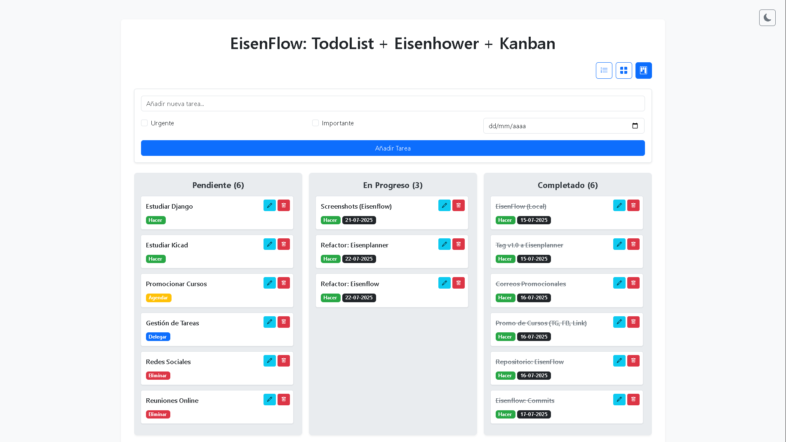

#### Modo Oscuro:
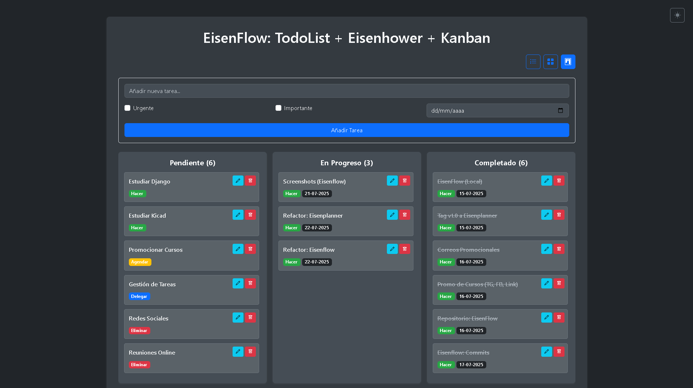

### Vista de Matriz (Eisenhower)

#### Modo Claro:
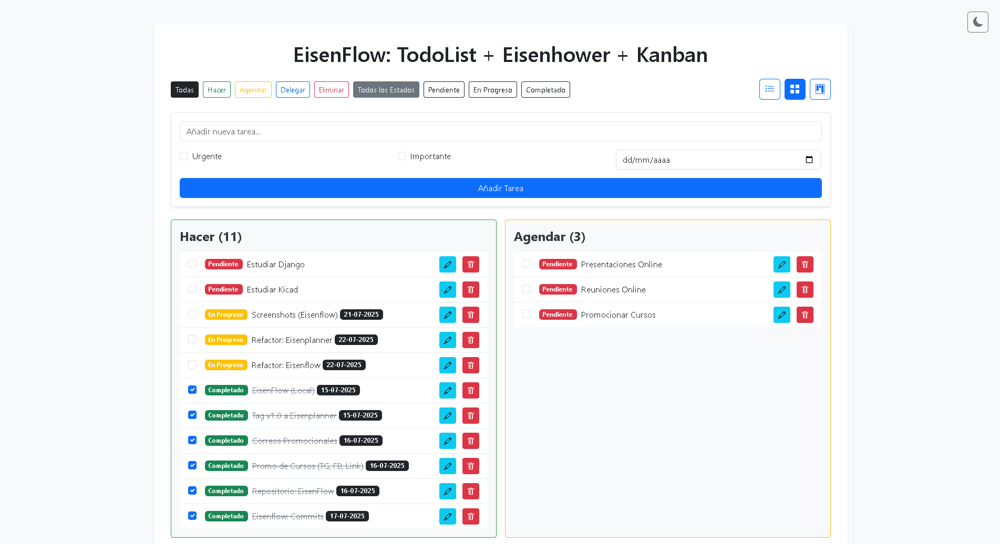

#### Modo Oscuro:
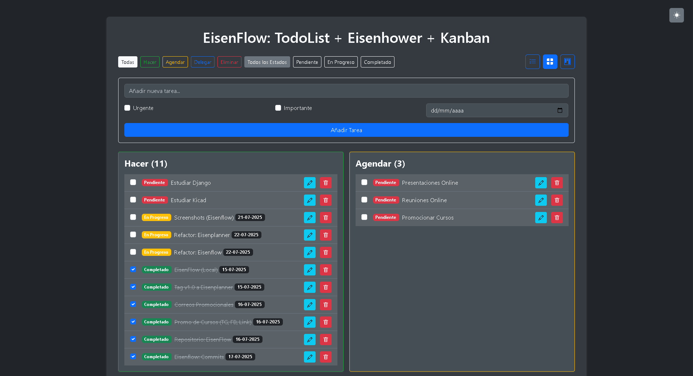

### Vista de Lista 

#### Modo Claro:
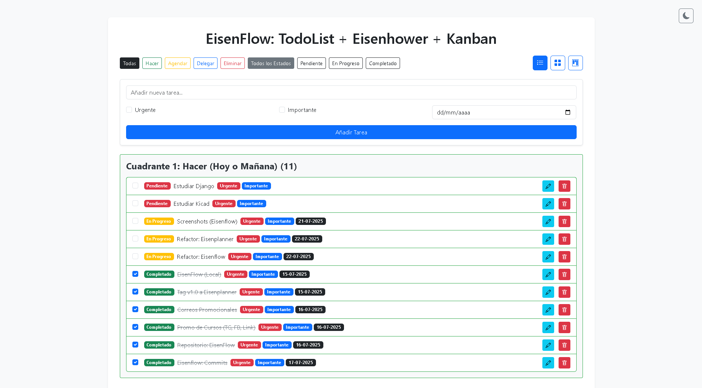

#### Modo Oscuro:
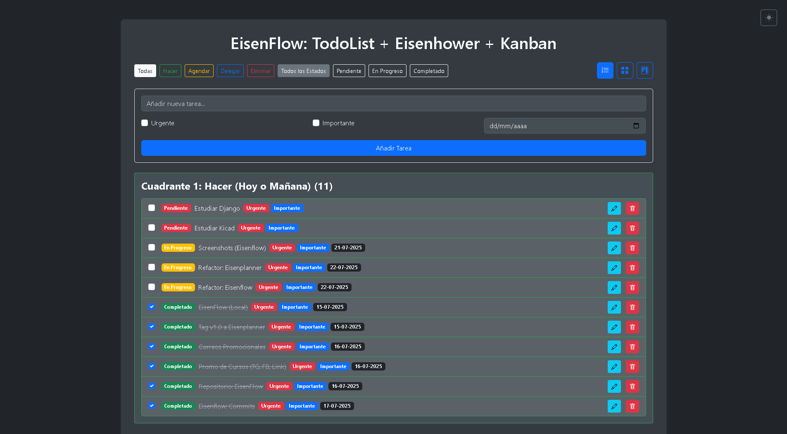

### Filtro de Progreso

#### Modo Claro:
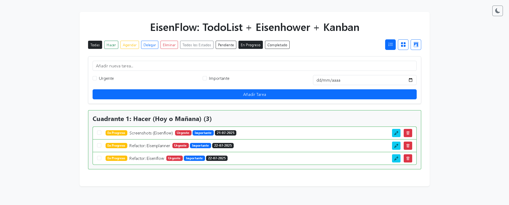

#### Modo Oscuro:
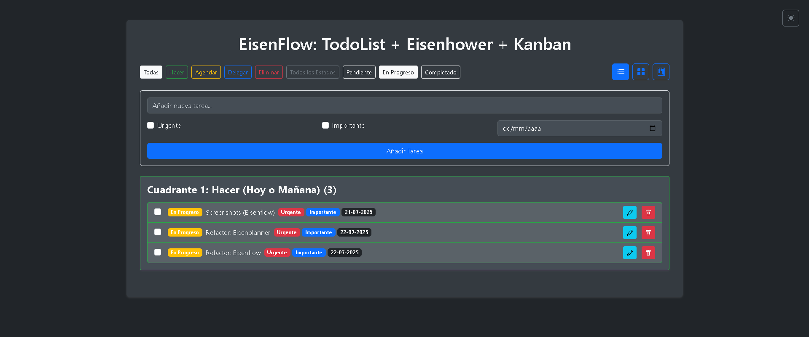

### Filtro por Cuadrante

#### Modo Claro:
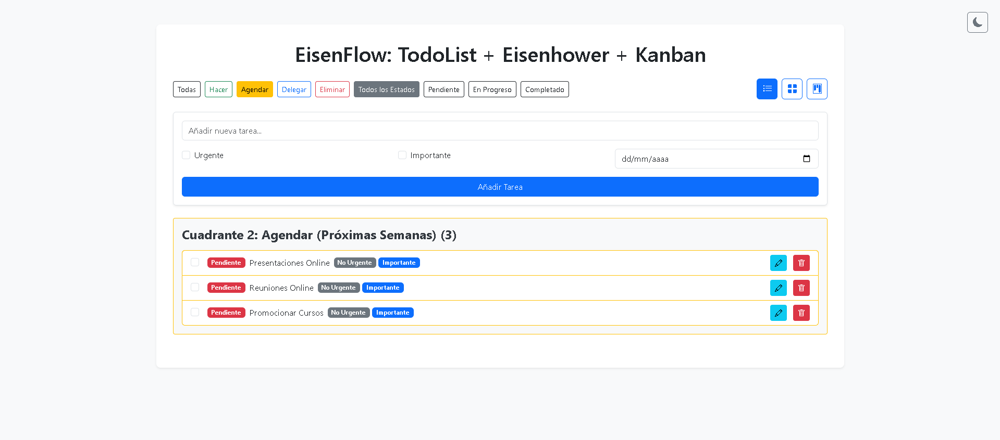

#### Modo Oscuro:
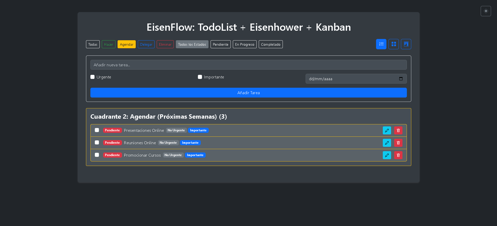

### Edición de Tarea

#### Modo Claro:
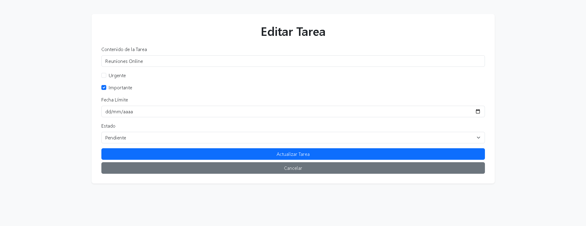


-----

## ✅ Mejoras Implementadas sobre la base de Eisenplanner

  - [x] **Vista Kanban:** Implementación de un tablero Kanban interactivo con drag-and-drop.
  - [x] **Actualización de conteos en Kanban:** Recuento de tareas en tiempo real por columna al mover tarjetas.
  - [x] **Tachado automático:** Texto de tarea tachado instantáneamente al marcar como completada en todas las vistas (Lista, Matriz, Kanban).
  - [x] **Reordenamiento de tareas completadas:** Las tareas completadas se mueven automáticamente al final de la Lista y de cada cuadrante en la Matriz.
  - [x] **Persistencia de vista y filtros:** Al editar o eliminar tareas, la aplicación regresa a la vista y filtros exactos que tenías activos.
  - [x] **Orden de botones de vista personalizado:** Los botones de navegación de vista ahora están en el orden `Lista`, `Matriz`, `Kanban` para un flujo de trabajo optimizado.
  - [x] Filtro de estado para la vista de Matriz funcionando correctamente.
  - [x] Orden de tareas en Kanban por importancia/urgencia y fecha de vencimiento.
  - [x] Funcionalidad de Modo Oscuro mejorada y persistente.

-----

## 🌱 Próximos Pasos (Ideas a Futuro)

  - **Edición en línea o rápida:** Para cambios menores en el contenido o la fecha de vencimiento sin tener que ir a una página de edición separada.
  - **Archivado de Tareas:** Implementar una funcionalidad para archivar tareas completadas en lugar de eliminarlas, manteniendo el historial.
  - **Notificaciones/Recordatorios:** Añadir alertas para tareas próximas a vencer.
  - **Búsqueda de Tareas:** Integrar una barra de búsqueda para encontrar tareas por palabras clave.

-----

## Cómo Ejecutar el Proyecto Localmente

Para configurar y ejecutar EisenFlow en tu máquina local, sigue estos pasos:

1.  **Clona el repositorio:**

    ```bash
    git clone https://github.com/ingwplanchez/eisenflow.git
    cd EisenFlow
    ```
 
2.  **Crea un entorno virtual (recomendado):**

    ```bash
    python -m venv venv
    ```

3.  **Activa el entorno virtual:**

      * En Windows:
        ```bash
        .\venv\Scripts\activate
        ```
      * En macOS/Linux:
        ```bash
        source venv/bin/activate
        ```

4.  **Instala las dependencias:**
    ```bash
    pip install -r requirements.txt
    ```

    (Puedes crear un `requirements.txt` ejecutando `pip freeze > requirements.txt` después de instalar estas).

5.  **Inicializa la base de datos:**

    ```bash
    python -c "from app import db; db.create_all()"
    ```

    (Esto asume que tu archivo principal de Flask se llama `app.py` y que `db` está definido allí).

6.  **Ejecuta la aplicación:**

    ```bash
    flask run
    ```

    Si tu archivo principal de Flask no se llama `app.py`, necesitarás establecer la variable de entorno `FLASK_APP` antes de `flask run`:

      * En Windows (CMD): `set FLASK_APP=nombre_de_tu_app.py`
      * En Windows (PowerShell): `$env:FLASK_APP="nombre_de_tu_app.py"`
      * En macOS/Linux: `export FLASK_APP=nombre_de_tu_app.py`

7.  **Accede a la aplicación:**
    Abre tu navegador web y ve a `http://127.0.0.1:5000/`.

-----

## Estructura del Proyecto (Ejemplo)

```
EisenFlow/
├── venv/
├── app.py              # Archivo principal de Flask
├── tasks.db            # Base de datos SQLite (generada al ejecutar db.create_all())
├── templates/
│   ├── index.html      # Plantilla principal con las 3 vistas (Lista, Matriz, Kanban)
│   └── edit.html       # Plantilla para editar tareas
├── static/
│   ├── css/
│   │   └── style.css   # Estilos CSS personalizados
│   └── js/
│       └── scripts.js  # Scripts JS adicionales si los hubiera
└── README.md           # Este archivo
```

-----

## 📝 Créditos

  - 🛠️ Desarrollado a partir de la base funcional de [Eisenplanner v1.0](https://github.com/ingwplanchez/eisenplanner), que a su vez reutilizó código de [Flasktasker v2.0](https://github.com/ingwplanchez/flasktasker.git).
  - ✨ **EisenFlow** es el resultado de un proceso de mejora continua y personalización para crear una herramienta de productividad superior.

-----

## 📄 Licencia

Este proyecto está bajo la licencia [MIT](https://es.wikipedia.org/wiki/Licencia_MIT), lo que permite su uso y modificación libremente, siempre que se otorgue el debido crédito.

-----

